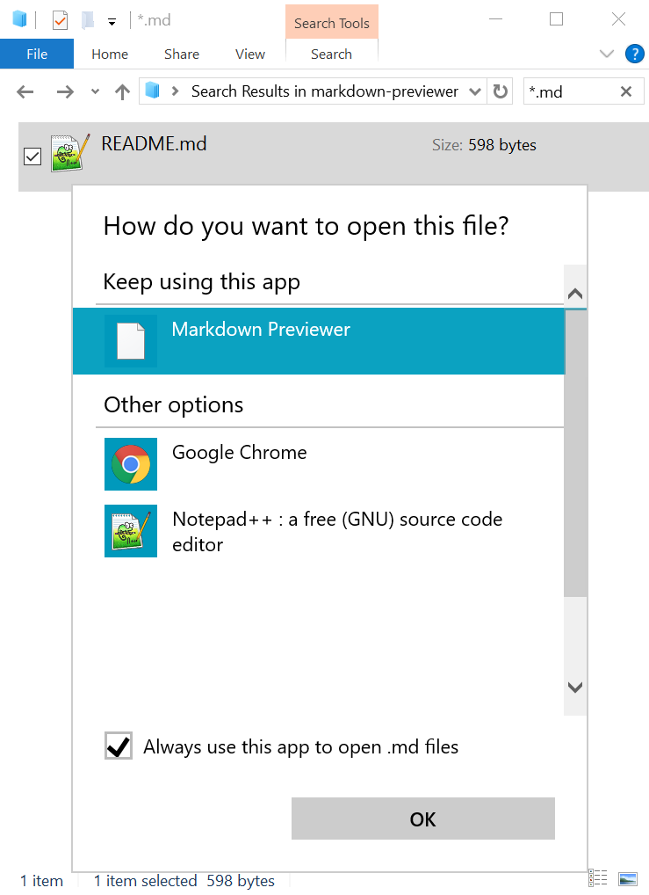

# Requirements
 - PHP 5 (≥ 5.3.0)
 - cURL extension enabled
 - An Internet connection to send a POST request to the GitHub API
 - Parent directory for Chrome added to your system path

---

# Setup
 - Run `markdown-previewer.reg`
 - Copy `markdown-previewer.cmd` to `C:\`
 - Choose `Open with` on a `*.md` file and set its handler as `Markdown Previewer`
   - `Markdown Previewer` may be hidden under the `More apps ↓` menu
   - You may need to navigate to `C:\markdown-previewer.cmd` before `Markdown Previewer` becomes an option

---

